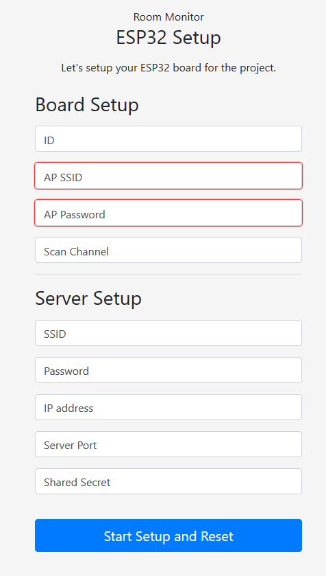

<h1 align="center">
  
   
</h1>

  Counting people using Wi-Fi devices.

 
 
 

## Indice

- [Indice](#indice)
- [Team di sviluppo](#team-di-sviluppo)
- [Codice sorgente progetti](#codice-sorgente-progetti)
- [Introduction](#introduction)
  - [Scansione Attiva](#scansione-attiva)
  - [Dispositivo ESP32](#dispositivo-esp32)
  - [Obiettivo del progetto](#obiettivo-del-progetto)
- [ESP32 Firmware](#esp32-firmware)
  - [Scopo](#scopo)
  - [Configurazione](#configurazione)
  - [Funzionamento](#funzionamento)
  - [Spiegazione tecnica](#spiegazione-tecnica)
    - [Captive Portal](#captive-portal)
    - [Sniffing](#sniffing)
    - [Validazione e Inoltro](#validazione-e-inoltro)
- [RoomMonitor Server](#roommonitor-server)
  - [Generale](#generale)
  - [Impostazioni](#impostazioni)
  - [Monitoraggio](#monitoraggio)
  - [Analisi](#analisi)
- [Sviluppi Futuri](#sviluppi-futuri)

Questo progetto è stato sviluppato partendo dalla [proposta di progetto](stuff/specs.pdf) fornita dal prof. Giovanni Malnati durante il corso "Programmazione di Sistema" nell' a.a. 2017/2018.

## Team di sviluppo

-  **Piero Macaluso** - [pieromacaluso](https://github.com/pieromacaluso)
-  **Lorenzo Manicone** - [lorenzomanicone](https://github.com/lorenzomanicone)
-  **Angelo Turco** - [angeloturco](https://github.com/angeloturco)

## Codice sorgente progetti

- [**RoomMonitor ESP32 Firmware**](ESP32firmwareCLion)
- [**RoomMonitor Server App**](RoomMonitor)

## Introduction

### Scansione Attiva

Ogni dispositivo WiFi, in particolare gli smartphone, possiedono la capacità di riconnettersi rapidamente ad una rete WiFi precedentemente associata non appena si vengono a trovare all'interno dell'area di copertura. Questa funzionalità è possibile grazie allo sfruttamento della *scansione attiva* dei nostri dispositivi: questi inviano, ad intervalli regolari, pacchetti broadcast di tipo **PROBE REQUEST** indicando in maniera facoltativa l'SSID per cui si richiede il collegamento.

### Dispositivo ESP32

Il dispositivo ESP32 utilizzato in questo progetto possiede un'implementazione dello stack WiFi, il quale permette allo stesso di registrare una callback da invocare ogni volta che viene ricevuto un pacchetto di tipo **CONTROL**, rilevando sia **BEACON**, sia **PROBE REQUEST**.

All'interno di questo pacchetto è possibile trovare la potenza del segnale ricevuto *RSSI (Received Signal Strenght Indicator)*. In condizioni ideali questo valore decresce esponenzialmente al crescere della distanza ed viene espresso in *dB*. I valori tipici variano tra -35/-40dB (molto vicino), fino a -95/-105dB (molto lontano).

Nella realtà sono presenti numerosi fattori che possono condizionare tale valore come ad esempio la presenza di riflessioni multiple dovute al terreno, ai muri e agli altri ostacoli, alla propagazione o alle interferenze con altri segnali presenti nell'ambiente.

In ogni caso rimane uno strumento utile per poter misurare la distanza del dispositivo.

### Obiettivo del progetto

L'obiettivo principale del software implementato è quello di fornire un sistema capace di monitorare numero e posizione di studenti all'interno di un'aula. Questo è possibile sfruttando i pacchetti PROBE REQUEST utilizzati dai dispositivi che normalmente utilizziamo: questi vengono catturati da una serie di schedine ESP32 (2 o più) per poi essere trasmessi ad un server che si occupa di filtrare e aggregare i pacchetti ricevuti da tutte le schedine in azione per ottenere l'informazione sulla posizione partendo dai valori dell'RSSI.
Da questi valori è possibile passare ad un valore della distanza del singolo dispositivo (identificato dal suo MAC) da ogni schedina, utile per procedere con una triangolazione della posizione.

## ESP32 Firmware

### Scopo

Lo scopo della board ESP32 è quello di sniffare i vari pacchetti **PROBE REQUEST** generati dai dispositivi vicini ed inoltrarli al server il quale si occuperà di gestirli.

### Configurazione

In fase di montaggio del sistema, occorre un addetto per inizializzare i corretti valori necessari per il funzionamento.
Per garantire una facile configurazione è stato implementato un *captive portal* dove poter introdurre i valori necessari senza dover modificare il firmware.
Per collegarsi a tale portale occorre connettersi alla rete Wi-Fi della board che si vuole configurare (default SSID: `esp32-ap`, Password: `progettopds`), dopodichè, tramite un browser (nota Chrome può avere problemi), collegarsi all'indirizzo `https://192.168.1.1`. (Nota, attenzione a non usare http ma **https**).
A questo punto verrà mostrata la pagina di configurazione della scheda dove poter inizializzare tutti i parametri necessari.

Come si vede è possibile cambiare le impostazioni della rete WiFi della scheda, assegnarle un ID (importante per configurazione server), e il canale su cui si vuole effettuare la scansione. Nella parte sottostante è possibile impostare tutti i parametri per la comunicazione con il server.
L’invio di questi parametri è reso sicuro tramite il protocollo **HTTPS**, garantendo confidenzialità, integrità ed autenticazione, invece per l’inoltro dei pacchetti sniffati verso il server attraverso canale TCP sono garantite le proprietà di autenticazione e integrità tramite l'utilizzo di HMAC-SHA256 con chiave a 256 bit per ogni pacchetto inoltrato.

### Funzionamento

Una volta configurata, la board si collegherà alla rete wifi del server. È importante che tale rete abbia una connessione ad internet in quanto la scheda userà tale connessione per ricevere l’orario corretto tramite un server SNTP.
Solo dopo aver acquisito l’orario, verrà avviata la procedura di sniffing e di inoltro.
Durante la fase di sniffing, verranno catturati tutti i vari PROBE REQUEST trasmessi sul canale indicato in fase di configurazione. Da tali pacchetti verranno estratte le informazioni necessarie e solo quando la fase di sniffing sarà terminata, tutti i dati acquisiti saranno inviati al server per poi riprendere con la prima fase.
Grazie all’utilizzo di un timer ogni minuto si provvede ad alternare la fase di sniffing e di inoltro. Per garantire il corretto sincronismo tra le varie schede e il server, lo stesso timer indica anche quando aggiornare l’orario eseguendo un’ulteriore richiesta al server SNTP.

### Spiegazione tecnica

#### Captive Portal

Per realizzare il meccanismo del captive portal è stato implementato un web server basato su HTTPS. Tale server risulta raggiungibile tramite l’indirizzo ip `192.168.1.1` sulla porta `443`. Sono stati definiti file HTML, CSS e Javascript che permettono l’inserimento dei vari parametri di configurazione.
È stato necessario anche l’uso di un certificato e di un file contenente la chiave privata per HTTPS.

L’utilizzo di apposite partizione di memorie ha permesso di memorizzare i valori impostati e i vari file utilizzati per implementare il server, in particolare si è deciso di usare una partizione **NVM**, tipo chiave-valore, per memorizzare i vari valori di inizializzazione. Tale partizione è basata su memoria non volatile che permette il salvataggio dei parametri anche in assenza di tensione.
Per gestire la partizione dedicata al captive portal è stato usato un apposito file system chiamato **SPIFFS** (Serial Peripheral Interface Flash File System).
 
#### Sniffing

In tale fase la board intercetta i vari pacchetti dei vari dispositivi. Per far ciò si utilizza la modalità promiscua, attraverso la quale, è possibile ricevere ed elaborare pacchetti non destinati al proprio dispositivo.

#### Validazione e Inoltro

*Work In Progress...*

## RoomMonitor Server

### Generale

### Impostazioni

### Monitoraggio

- Ricezione
- Aggregazione (Double Chance, Triangolazione)
- Storage nel DB

### Analisi

- Statistica di Lungo Periodo
- Analisi MAC nascosti
- Visualizzazione Movimento

## Sviluppi Futuri

*Work in Progress...*